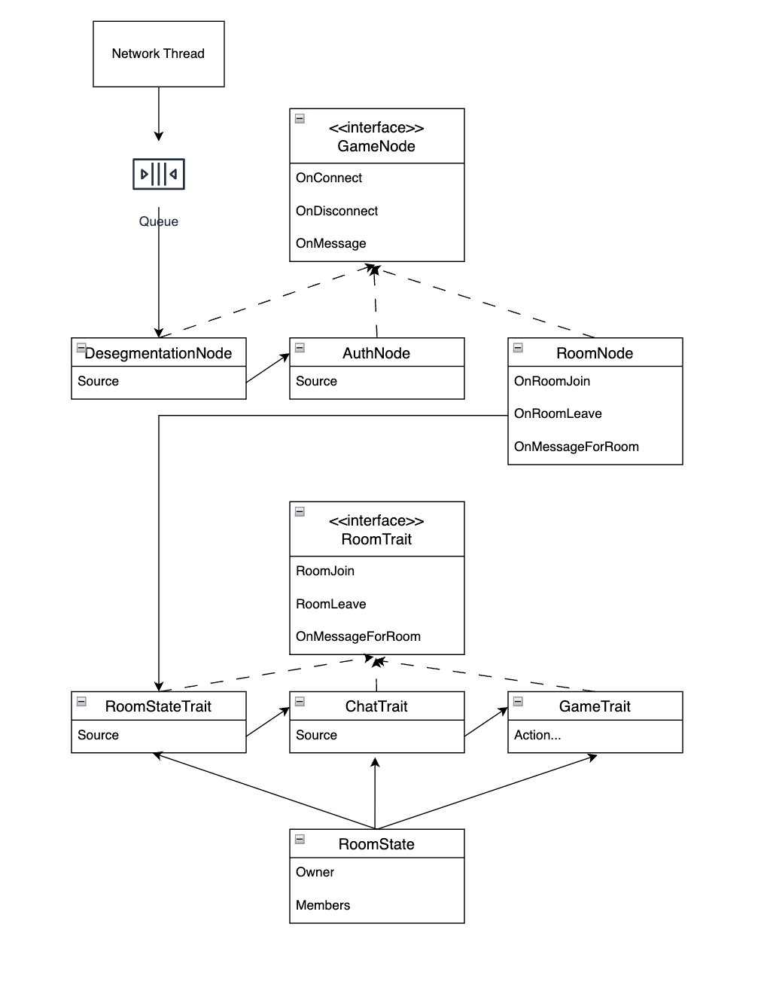
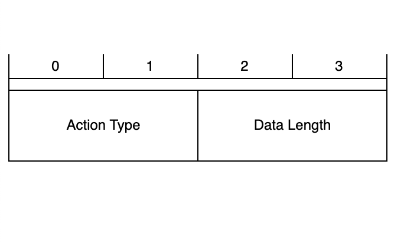

# 보드게임 온라인 포팅 소켓서버

전체 문서   
https://distinct-spade-023.notion.site/14f48ff9ff44485abe047ae894cbf98d

## 어플리케이션 아키텍트

  

### 주 컨셉
보드게임 특성상 다른방의 사용자와 상호작용할 필요가 없다.   
최소 스레드 단위를 방으로하여 공유자원 접근을 최소화 했다.

### Proxy패턴을 적극 사용한 이유
이후에 여러가지의 보드게임을 포팅할 예정인데 여러게임에 매우 유사한 다른 기능이 있을수 있다   
채팅기능으로 예시로 설명하면 간단한 채팅기능만 지원하면 되는 게임이 있는반면 팀과의 채팅이 있을수 있다   
더하여 팀이 게임중에 변경이 될 수 있어서 게임별로 특화된 기능이 추가하기 위함이다

## 프로토콜
TCP 기반의 프로토콜을 사용한다.   

### Header
  

## nuget
.net:8.0   
Serilog:3.1.1   
Serilog.Sinks.Console:5.0.1   
Serilog.Sinks.File:5.0.0   
Azure.Identity:1.10.4   
Azure.Security.KeyVault.Secrets:4.5.0   
System.IdentityModel.Tokens.Jwt:7.2.0   
